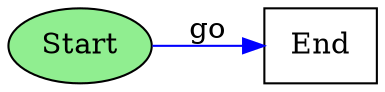
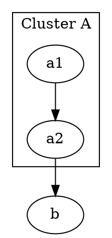

# DOT (Graphviz) Format

Convert graphs to and from [Graphviz](https://graphviz.org/) DOT format for layout and rendering.

## Features

- **Compound graphs**: Full support via subgraphs
- **Layout hints**: Direction (rankdir), shape, color
- **Both formats**: Directed (`digraph`) and undirected (`graph`)
- **Parser included**: Uses `dotparser` for parsing

## Installation

Requires the `dotparser` peer dependency:

```bash
pnpm add dotparser
```

## Import

```ts
import { toDOT, fromDOT, dotConverter } from '@statelyai/graph';
// Or from subpath:
import { toDOT } from '@statelyai/graph/dot';
```

## `toDOT()`

Converts a graph to DOT format string.

```ts
import { createGraph, toDOT } from '@statelyai/graph';

const graph = createGraph({
  id: 'G',
  direction: 'right',
  nodes: [
    { id: 'a', label: 'Start', shape: 'ellipse', color: '#90EE90' },
    { id: 'b', label: 'End', shape: 'rectangle' }
  ],
  edges: [
    { id: 'e0', sourceId: 'a', targetId: 'b', label: 'go', color: 'blue' }
  ]
});

const dot = toDOT(graph);
```

**Result:**



### Type Signature

```ts
function toDOT(graph: Graph): string
```

### Parameters

<ParamField path="graph" type="Graph" required>
  The graph to convert to DOT format
</ParamField>

### Returns

A DOT format string.

### Mapping

| Graph Property | DOT Syntax | Notes |
|----------------|-----------|-------|
| `graph.id` | `digraph <id>` | Graph name |
| `graph.type` | `digraph` / `graph` | Directed vs undirected |
| `graph.direction` | `rankdir=TB/BT/LR/RL` | Layout direction |
| `node.id` | Node identifier | Escaped if needed |
| `node.label` | `label="..."` | Node label |
| `node.shape` | `shape=box/ellipse/...` | See shape mapping below |
| `node.color` | `fillcolor="..." style=filled` | Node fill color |
| `node.parentId` | Subgraph nesting | Compound hierarchy |
| `edge.sourceId -> edge.targetId` | `a -> b` or `a -- b` | Arrow syntax |
| `edge.label` | `label="..."` | Edge label |
| `edge.color` | `color="..."` | Edge color |

### Shape Mapping

| Graph Shape | DOT Shape |
|-------------|----------|
| `rectangle` | `box` |
| `ellipse` | `ellipse` |
| `circle` | `circle` |
| `diamond` | `diamond` |
| `hexagon` | `hexagon` |
| `cylinder` | `cylinder` |
| `parallelogram` | `parallelogram` |

### Direction Mapping

| Graph Direction | DOT Rankdir |
|----------------|-------------|
| `down` | `TB` (top to bottom) |
| `up` | `BT` (bottom to top) |
| `right` | `LR` (left to right) |
| `left` | `RL` (right to left) |

## `fromDOT()`

Parses a DOT format string into a graph.

```ts
import { fromDOT } from '@statelyai/graph';

const graph = fromDOT(`
  digraph {
    a -> b;
    b -> c;
  }
`);

graph.nodes; // [{id: 'a', ...}, {id: 'b', ...}, {id: 'c', ...}]
graph.edges; // [{sourceId: 'a', targetId: 'b', ...}, ...]
```

### Type Signature

```ts
function fromDOT(dot: string): Graph
```

### Parameters

<ParamField path="dot" type="string" required>
  DOT format string to parse
</ParamField>

### Returns

A `Graph` object.

### Supported DOT Features

✅ **Supported:**
- Node and edge declarations
- Labels, shapes, colors
- Subgraphs (converted to compound nodes)
- Graph/node/edge attributes
- `rankdir` for direction
- Both `digraph` and `graph`
- Default attributes (`node [shape=box]`)
- Attribute statements

⚠️ **Limitations:**
- HTML labels stored as-is (not parsed)
- Port syntax (`:port:compass`) ignored
- Layout hints beyond `rankdir` ignored
- `rank=same` and other constraints ignored

### Error Handling

```ts
try {
  const graph = fromDOT('invalid syntax');
} catch (error) {
  console.error(error.message);
  // "DOT: parse error — unexpected token"
}

fromDOT(''); // Error: DOT: input is empty
fromDOT(123); // Error: DOT: expected a string
```

## `dotConverter`

Bidirectional converter object.

```ts
import { createGraph, dotConverter } from '@statelyai/graph';

const graph = createGraph({
  nodes: [{ id: 'a' }, { id: 'b' }],
  edges: [{ sourceId: 'a', targetId: 'b' }]
});

const dot = dotConverter.to(graph);
const roundTripped = dotConverter.from(dot);
```

### Type

```ts
const dotConverter: GraphFormatConverter<string>
```

## Compound Graphs (Subgraphs)

```ts
import { createGraph, toDOT } from '@statelyai/graph';

const graph = createGraph({
  nodes: [
    { id: 'cluster_a', label: 'Cluster A' },
    { id: 'a1', parentId: 'cluster_a' },
    { id: 'a2', parentId: 'cluster_a' },
    { id: 'b' }
  ],
  edges: [
    { sourceId: 'a1', targetId: 'a2' },
    { sourceId: 'a2', targetId: 'b' }
  ]
});

const dot = toDOT(graph);
```

**Result:**



## Undirected Graphs

```ts
import { createGraph, toDOT } from '@statelyai/graph';

const graph = createGraph({
  type: 'undirected',
  nodes: [{ id: 'a' }, { id: 'b' }],
  edges: [{ sourceId: 'a', targetId: 'b' }]
});

const dot = toDOT(graph);
// graph "" {
//   a;
//   b;
//   a -- b;
// }
```

## Rendering with Graphviz

```bash
# Save DOT string to file
echo "$DOT_STRING" > graph.dot

# Render as PNG
dot -Tpng graph.dot -o graph.png

# Render as SVG
dot -Tsvg graph.dot -o graph.svg

# Use different layout engines
neato -Tpng graph.dot -o graph.png  # spring layout
fdp -Tpng graph.dot -o graph.png    # force-directed
circo -Tpng graph.dot -o graph.png  # circular
```

## Advanced Example

```ts
import { createGraph, toDOT } from '@statelyai/graph';

const graph = createGraph({
  id: 'StateMachine',
  direction: 'right',
  nodes: [
    { id: 'start', label: '', shape: 'circle', color: 'black' },
    { id: 'idle', label: 'Idle', shape: 'rectangle' },
    { id: 'loading', label: 'Loading', shape: 'rectangle' },
    { id: 'success', label: 'Success', shape: 'rectangle', color: '#90EE90' },
    { id: 'error', label: 'Error', shape: 'rectangle', color: '#FFB6C6' }
  ],
  edges: [
    { sourceId: 'start', targetId: 'idle' },
    { sourceId: 'idle', targetId: 'loading', label: 'FETCH' },
    { sourceId: 'loading', targetId: 'success', label: 'RESOLVE' },
    { sourceId: 'loading', targetId: 'error', label: 'REJECT' },
    { sourceId: 'success', targetId: 'idle', label: 'RESET' },
    { sourceId: 'error', targetId: 'idle', label: 'RETRY' }
  ]
});

const dot = toDOT(graph);
console.log(dot);
```

## See Also

- [GraphML Format](/api/formats/graphml) - XML-based alternative
- [GML Format](/api/formats/other-formats#gml) - Text-based alternative
- [Format Overview](/api/formats/overview) - All supported formats
