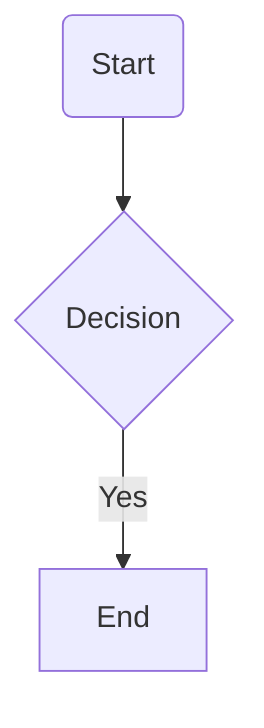
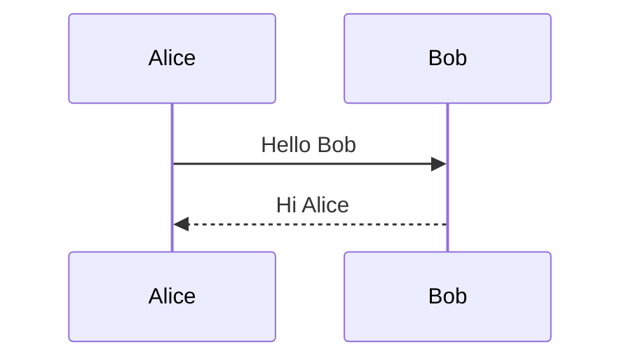

# Mermaid Diagrams

Convert graphs to and from [Mermaid](https://mermaid.js.org/) diagram-as-code format. Supports 7 diagram types.

## Features

- **7 diagram types**: Flowchart, sequence, state, class, ER, mindmap, block
- **No dependencies**: Pure JavaScript conversion
- **Diagram-specific**: Each type has specialized node/edge data
- **Round-trip safe**: Preserves diagram-specific features

## Import

```ts
import {
  // Flowchart
  toMermaidFlowchart,
  fromMermaidFlowchart,
  mermaidFlowchartConverter,
  
  // Sequence
  toMermaidSequence,
  fromMermaidSequence,
  mermaidSequenceConverter,
  
  // State
  toMermaidState,
  fromMermaidState,
  mermaidStateConverter,
  
  // Class
  toMermaidClass,
  fromMermaidClass,
  mermaidClassConverter,
  
  // ER
  toMermaidER,
  fromMermaidER,
  mermaidERConverter,
  
  // Mindmap
  toMermaidMindmap,
  fromMermaidMindmap,
  mermaidMindmapConverter,
  
  // Block
  toMermaidBlock,
  fromMermaidBlock,
  mermaidBlockConverter,
} from '@statelyai/graph';
```

## Flowchart Diagrams

### `toMermaidFlowchart()`

Converts a graph to a Mermaid flowchart.

```ts
import { createGraph, toMermaidFlowchart } from '@statelyai/graph';

const graph = createGraph({
  direction: 'down',
  nodes: [
    { id: 'A', label: 'Start', shape: 'rounded' },
    { id: 'B', label: 'Decision', shape: 'diamond' },
    { id: 'C', label: 'End', shape: 'rectangle' }
  ],
  edges: [
    { id: 'e0', sourceId: 'A', targetId: 'B' },
    { id: 'e1', sourceId: 'B', targetId: 'C', label: 'Yes' }
  ]
});

const mermaid = toMermaidFlowchart(graph);
```

**Result:**



#### Shape Support

| Graph Shape | Mermaid Syntax | Description |
|-------------|----------------|-------------|
| `rectangle` | `[text]` | Rectangle (default) |
| `rounded` | `(text)` | Rounded rectangle |
| `circle` | `((text))` | Circle |
| `double-circle` | `(((text)))` | Double circle |
| `stadium` | `([text])` | Stadium (pill) |
| `cylinder` | `[(text)]` | Cylinder/database |
| `diamond` | `{text}` | Diamond/decision |
| `hexagon` | `{{text}}` | Hexagon |
| `parallelogram` | `[/text/]` | Parallelogram |
| `trapezoid` | `[/text\]` | Trapezoid |
| `asymmetric` | `>text]` | Asymmetric/flag |
| `subroutine` | `[[text]]` | Subroutine |

#### Edge Styles

```ts
const graph = createGraph({
  edges: [
    // Normal arrow
    { sourceId: 'A', targetId: 'B', data: { stroke: 'normal', arrowType: 'arrow' } },
    
    // Dotted line
    { sourceId: 'B', targetId: 'C', data: { stroke: 'dotted', arrowType: 'arrow' } },
    
    // Thick line
    { sourceId: 'C', targetId: 'D', data: { stroke: 'thick', arrowType: 'arrow' } },
    
    // No arrow
    { sourceId: 'D', targetId: 'E', data: { stroke: 'normal', arrowType: 'none' } },
    
    // Bidirectional
    { sourceId: 'E', targetId: 'F', data: { bidirectional: true } },
    
    // Circle/cross markers
    { sourceId: 'F', targetId: 'G', data: { endMarker: 'circle' } },
    { sourceId: 'G', targetId: 'H', data: { endMarker: 'cross' } }
  ]
});
```

#### Subgraphs (Compound Graphs)

```ts
const graph = createGraph({
  nodes: [
    { id: 'sub1', label: 'Subgraph 1' },
    { id: 'A', parentId: 'sub1' },
    { id: 'B', parentId: 'sub1' },
    { id: 'C' }
  ],
  edges: [
    { sourceId: 'A', targetId: 'B' },
    { sourceId: 'B', targetId: 'C' }
  ]
});

const mermaid = toMermaidFlowchart(graph);
// flowchart TD
//     subgraph sub1[Subgraph 1]
//         A
//         B
//         A --> B
//     end
//     C
//     B --> C
```

### `fromMermaidFlowchart()`

```ts
import { fromMermaidFlowchart } from '@statelyai/graph';

const graph = fromMermaidFlowchart(`
flowchart TD
    A[Start] --> B{Decision}
    B -->|Yes| C[End]
`);
```

## Sequence Diagrams

### `toMermaidSequence()`

```ts
import { createGraph, toMermaidSequence } from '@statelyai/graph';

const graph = createGraph({
  nodes: [
    { id: 'Alice', data: { actorType: 'participant' } },
    { id: 'Bob', data: { actorType: 'participant' } }
  ],
  edges: [
    { 
      sourceId: 'Alice', 
      targetId: 'Bob',
      label: 'Hello Bob',
      data: { kind: 'message', stroke: 'solid', arrowType: 'filled' }
    },
    { 
      sourceId: 'Bob', 
      targetId: 'Alice',
      label: 'Hi Alice',
      data: { kind: 'message', stroke: 'dotted', arrowType: 'filled' }
    }
  ],
  data: { diagramType: 'sequence' }
});

const mermaid = toMermaidSequence(graph);
```

**Result:**



#### Actor Types

```ts
const nodes = [
  { id: 'A', data: { actorType: 'participant' } },
  { id: 'B', data: { actorType: 'actor' } },
  { id: 'C', data: { actorType: 'boundary' } },
  { id: 'D', data: { actorType: 'control' } },
  { id: 'E', data: { actorType: 'entity' } },
  { id: 'F', data: { actorType: 'database' } },
  { id: 'G', data: { actorType: 'collections' } },
  { id: 'H', data: { actorType: 'queue' } }
];
```

#### Arrow Types

| Stroke | Arrow Type | Mermaid | Description |
|--------|-----------|---------|-------------|
| `solid` | `filled` | `->>` | Solid arrow |
| `solid` | `open` | `->` | Solid line, open arrow |
| `solid` | `cross` | `-x` | Solid line, cross |
| `solid` | `async` | `-)` | Async message |
| `dotted` | `filled` | `-->>` | Dotted arrow |
| `dotted` | `open` | `-->` | Dotted line, open arrow |
| `dotted` | `cross` | `--x` | Dotted line, cross |
| `dotted` | `async` | `--)` | Dotted async |

#### Control Flow Blocks

```ts
const graph = createGraph({
  data: {
    diagramType: 'sequence',
    blocks: [
      {
        type: 'loop',
        label: 'Every minute',
        edgeIds: ['e0', 'e1']
      },
      {
        type: 'alt',
        label: 'Successful response',
        branches: [
          { label: 'Successful response', edgeIds: ['e2'] },
          { label: 'Failed response', edgeIds: ['e3'] }
        ]
      }
    ]
  }
});
```

Supported blocks: `loop`, `alt`, `opt`, `par`, `critical`, `break`, `rect`

### `fromMermaidSequence()`

```ts
import { fromMermaidSequence } from '@statelyai/graph';

const graph = fromMermaidSequence(`
sequenceDiagram
    participant Alice
    participant Bob
    Alice->>Bob: Hello
`);
```

## State Diagrams

### `toMermaidState()` / `fromMermaidState()`

```ts
import { createGraph, toMermaidState } from '@statelyai/graph';

const graph = createGraph({
  initialNodeId: 'idle',
  nodes: [
    { id: 'idle', label: 'Idle' },
    { id: 'loading', label: 'Loading' },
    { id: 'success', label: 'Success' }
  ],
  edges: [
    { sourceId: 'idle', targetId: 'loading', label: 'FETCH' },
    { sourceId: 'loading', targetId: 'success', label: 'RESOLVE' }
  ],
  data: { diagramType: 'state' }
});

const mermaid = toMermaidState(graph);
// stateDiagram-v2
//     [*] --> idle
//     idle --> loading : FETCH
//     loading --> success : RESOLVE
```

Supports:
- Initial state markers
- Final states
- Composite states (via `parentId`)
- Choice nodes
- Fork/join

## Class Diagrams

### `toMermaidClass()` / `fromMermaidClass()`

```ts
import { createGraph, toMermaidClass } from '@statelyai/graph';

const graph = createGraph({
  nodes: [
    { 
      id: 'Animal',
      data: {
        attributes: ['+name: string', '+age: int'],
        methods: ['+makeSound(): void']
      }
    },
    { 
      id: 'Dog',
      data: {
        attributes: ['+breed: string'],
        methods: ['+bark(): void']
      }
    }
  ],
  edges: [
    { 
      sourceId: 'Dog', 
      targetId: 'Animal',
      data: { relationType: 'inheritance' }
    }
  ],
  data: { diagramType: 'class' }
});

const mermaid = toMermaidClass(graph);
// classDiagram
//     class Animal {
//         +name: string
//         +age: int
//         +makeSound(): void
//     }
//     class Dog {
//         +breed: string
//         +bark(): void
//     }
//     Dog <|-- Animal
```

Relation types: `inheritance`, `composition`, `aggregation`, `association`, `link`, `dependency`, `realization`

## ER Diagrams

### `toMermaidER()` / `fromMermaidER()`

```ts
import { createGraph, toMermaidER } from '@statelyai/graph';

const graph = createGraph({
  nodes: [
    { 
      id: 'CUSTOMER',
      data: {
        attributes: ['string name', 'int age']
      }
    },
    { 
      id: 'ORDER',
      data: {
        attributes: ['int orderNumber', 'date orderDate']
      }
    }
  ],
  edges: [
    { 
      sourceId: 'CUSTOMER', 
      targetId: 'ORDER',
      label: 'places',
      data: {
        leftCardinality: 'one-or-more',
        rightCardinality: 'zero-or-more'
      }
    }
  ],
  data: { diagramType: 'er' }
});

const mermaid = toMermaidER(graph);
// erDiagram
//     CUSTOMER ||--o{ ORDER : places
//     CUSTOMER {
//         string name
//         int age
//     }
//     ORDER {
//         int orderNumber
//         date orderDate
//     }
```

Cardinality options: `zero-or-one`, `exactly-one`, `zero-or-more`, `one-or-more`

## Mindmap Diagrams

### `toMermaidMindmap()` / `fromMermaidMindmap()`

```ts
import { createGraph, toMermaidMindmap } from '@statelyai/graph';

const graph = createGraph({
  initialNodeId: 'root',
  nodes: [
    { id: 'root', label: 'Central Idea' },
    { id: 'a', label: 'Branch A', parentId: 'root' },
    { id: 'b', label: 'Branch B', parentId: 'root' },
    { id: 'a1', label: 'Sub A1', parentId: 'a' }
  ],
  data: { diagramType: 'mindmap' }
});

const mermaid = toMermaidMindmap(graph);
// mindmap
//   root((Central Idea))
//     Branch A
//       Sub A1
//     Branch B
```

Note: Mindmaps use `parentId` for tree structure, not `edges`.

## Block Diagrams

### `toMermaidBlock()` / `fromMermaidBlock()`

```ts
import { createGraph, toMermaidBlock } from '@statelyai/graph';

const graph = createGraph({
  nodes: [
    { id: 'A', label: 'Block A', data: { blockType: 'default' } },
    { id: 'B', label: 'Block B', data: { blockType: 'round' } },
    { id: 'C', label: 'Block C', data: { blockType: 'diamond' } }
  ],
  edges: [
    { sourceId: 'A', targetId: 'B' },
    { sourceId: 'B', targetId: 'C' }
  ],
  data: { diagramType: 'block' }
});

const mermaid = toMermaidBlock(graph);
// block-beta
//   columns 3
//   A["Block A"]
//   B("Block B")
//   C{"Block C"}
//   A --> B
//   B --> C
```

## Rendering Mermaid

### In Markdown

```markdown

```

### With mermaid.js

```html
<script type="module">
  import mermaid from 'https://cdn.jsdelivr.net/npm/mermaid@10/dist/mermaid.esm.min.mjs';
  mermaid.initialize({ startOnLoad: true });
</script>

<div class="mermaid">
flowchart TD
    A --> B
</div>
```

### Programmatically

```ts
import { toMermaidFlowchart } from '@statelyai/graph';
import mermaid from 'mermaid';

const mermaidCode = toMermaidFlowchart(graph);

const { svg } = await mermaid.render('graphDiv', mermaidCode);
document.getElementById('output').innerHTML = svg;
```

## Type Definitions

```ts
// Flowchart
interface FlowchartNodeData {
  classes?: string[];
  link?: string;
  tooltip?: string;
  direction?: 'up' | 'down' | 'left' | 'right';
}

interface FlowchartEdgeData {
  stroke: 'normal' | 'dotted' | 'thick' | 'invisible';
  arrowType: 'arrow' | 'none';
  endMarker?: 'arrow' | 'circle' | 'cross';
  startMarker?: 'arrow' | 'circle' | 'cross';
  bidirectional?: boolean;
}

// Sequence
interface SequenceNodeData {
  actorType: 'participant' | 'actor' | 'boundary' | 'control' | 'entity' | 'database' | 'collections' | 'queue';
  alias?: string;
  created?: boolean;
  destroyed?: boolean;
}

interface SequenceEdgeData {
  kind: 'message' | 'activation' | 'deactivation';
  stroke?: 'solid' | 'dotted';
  arrowType?: 'filled' | 'open' | 'cross' | 'async';
  bidirectional?: boolean;
}
```

## See Also

- [DOT Format](/api/formats/dot) - Another diagram-as-code format
- [Format Overview](/api/formats/overview) - All supported formats
- [Mermaid Documentation](https://mermaid.js.org/) - Official Mermaid docs
